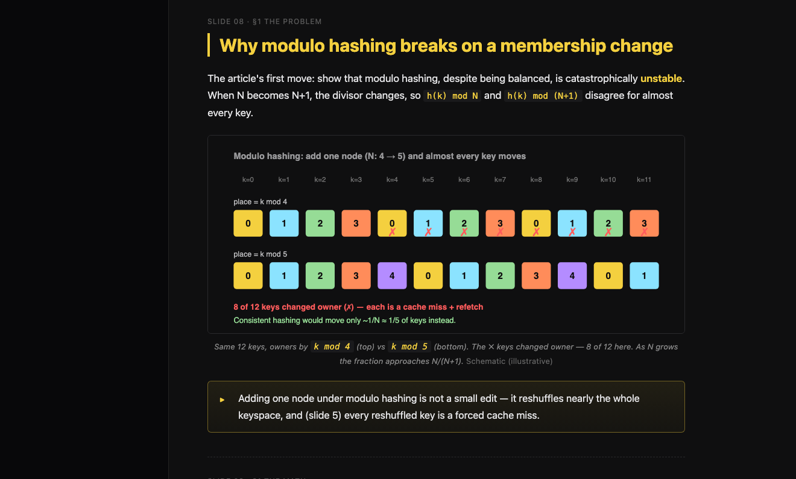
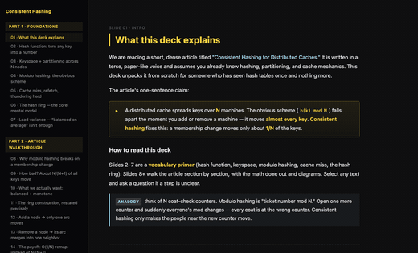

# explainer-deck

A [Claude Code](https://claude.com/claude-code) **skill** that turns a dense technical article into a beginner-friendly, single-HTML teaching deck — a "陪读 PPT" that explains the article from scratch, paragraph by paragraph.

Point it at a hard paper / blog post / whitepaper and it produces one self-contained `index.html` with:

- **Foundation slides** — every jargon term explained from zero (transistor, GPU, wafer, KV cache, warrant, …), grouped ~15 slides.
- **Walkthrough slides** — the article section by section, with analogies, explicit math, comparison tables, and ASCII diagrams (~45 slides).
- **8–12 figures** — real product photos, hand-authored SVG schematics, and (optionally) AI-generated diagrams. Every genuinely hard/abstract concept gets a picture.
- **Bilingual "deepdive" resource boxes** — vetted external videos/blogs for each foundation concept.
- **A built-in select-text-to-ask Q&A layer** — highlight any passage, type a question, and Claude answers it in the same session, with history persisted into the deck folder.
- Dark theme + yellow accent, sticky TOC, keyboard navigation (← / → / space).

## Demo

A full sample deck is in [`examples/consistent-hashing/`](examples/consistent-hashing/) — built by this skill from an original, copyright-free article (`examples/consistent-hashing/article.txt`).



Scroll-through of the whole 22-slide deck:



▶ Higher-quality MP4: [`media/demo.mp4`](media/demo.mp4)

Run it locally (with the live select-text-to-ask Q&A layer):

```bash
cd examples/consistent-hashing/explainer
python3 qa/qa-server.py        # prints a local URL; open it in a browser
```

## Install

Clone into your Claude Code skills directory so the folder is named `explainer-deck`:

```bash
git clone https://github.com/sunxiayi/explainer-deck.git ~/.claude/skills/explainer-deck
# or, per-project:
git clone https://github.com/sunxiayi/explainer-deck.git .claude/skills/explainer-deck
```

The skill is self-contained — the article fetcher and the anti-AI-voice rules it depends on are bundled under `references/`.

## Usage

In Claude Code:

```
/explainer-deck <article-url-or-path> [flags]
```

Examples:

```
/explainer-deck https://example.com/some-dense-paper
/explainer-deck https://arxiv.org/abs/xxxx --language chinese
/explainer-deck ./article.txt --language english --image gpt --api-key sk-...
```

### Flags

| Flag | Values | Default | Effect |
|---|---|---|---|
| `--language` | `english` \| `chinese` | `english` | Output language of the whole deck. English decks use English-only resources; Chinese decks add bilingual EN+CN deepdive links and apply the Chinese anti-AI-voice banlist. |
| `--image` | `neo` \| `gemini` \| `gpt` | *(off)* | Backend for **AI-generated** concept diagrams. `--image neo` drives ChatGPT via the [`neo`](#optional-dependencies) CLI; `--image gemini`/`--image gpt` use an image API (pass `--api-key`). If omitted, visuals come from real photos + hand-authored SVG only. |

## How it works (10-step pipeline)

1. **Fetch** the article (`references/fetch_article.py`, curl-first with a browser fallback).
2. **Plan** the foundation vocabulary list + a section-by-section walkthrough.
3. **Write** the deck shell + foundation slides (consistent, hand-written).
4. **Fan out** parallel agents for the walkthrough sections.
5. **Gather images** — the article's own figures first, then canonical product photos.
5.5. **Generate concept diagrams** — every hard/abstract idea gets a figure (real photo → SVG → AI image, chosen per concept).
6. **Assemble** the agent outputs into the deck.
7. **Inject** images + "deepdive" resource boxes.
8. **Verify** (slide/TOC counts, no broken images, anti-AI-voice self-check).
9. **Install** the Q&A layer and start its local server.
10. **Report** to the user.

The full spec lives in [`SKILL.md`](SKILL.md); building blocks are in [`references/`](references/) (`deck-template.html`, `slide-patterns.md`, `workflow.md`, `resource-bank.md`, the `qa/` bundle, `anti-ai-voice.md`).

## Requirements

- **Claude Code** (this is a skill, not a standalone CLI).
- **Python 3** — for the fetcher and the Q&A server.
- **Google Chrome** — used headless to render SVG diagrams to PNG for self-review (the skill renders and *looks at* every diagram before injecting it).

### Optional dependencies

- **AI image generation (`--image`):**
  - `--image gpt` / `--image gemini` — an OpenAI or Gemini/Imagen image-API key (pass via `--api-key`).
  - `--image neo` — the `neo` browser-automation CLI ("turn any web app into an API"), logged into chatgpt.com. No key needed, but slower and more fragile. For structural diagrams a hand-authored SVG is usually more accurate (labels never garble), so AI image-gen is best reserved for illustrative / analogy art.

## Design notes

- **Accuracy-first.** Precise/numeric figures (roofline curves, exact reductions) stay as ASCII or hand-authored SVG, never an image model that would mislabel them. The skill renders and reviews every generated figure before it goes in.
- **Anti-AI-voice.** Chinese decks are checked against a banlist of LLM-flavored phrasings (insight-frame openers, false-dichotomy reframing, absolutes, hype inflation). English decks keep the same spirit.
- **You own the Q&A server lifecycle.** It keeps running until you tell Claude to stop it.

## License

[MIT](LICENSE) © 2026 Xiayi Sun.

Resource links in `references/resource-bank.md` point to third-party content owned by their respective creators.
